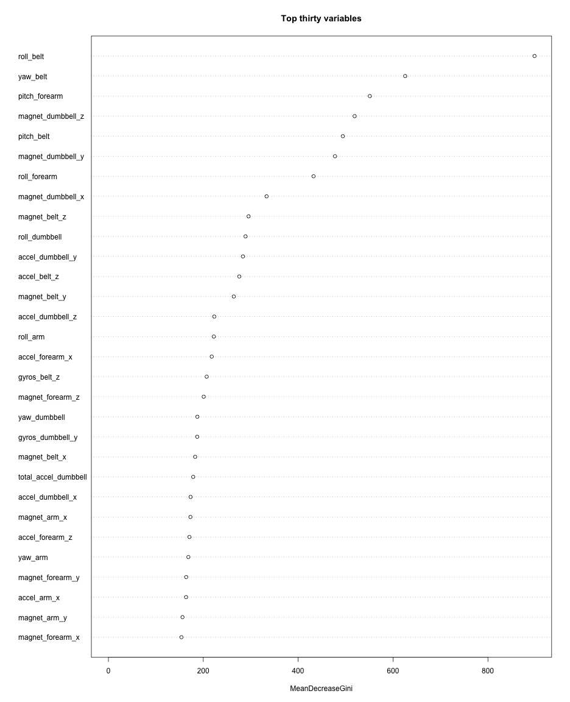

Predicting Exercise Performance
=========

## Synopsis
We predict how well an exercise was executed by participants wearing accelerometers.  See the following url for more information on the data: 

http://groupware.les.inf.puc-rio.br/har

## Pre-processing 

We load the necessary packages.  

```r
library(randomForest)
```

```
## Warning: package 'randomForest' was built under R version 3.1.1
```

```
## randomForest 4.6-10
## Type rfNews() to see new features/changes/bug fixes.
```

```r
library(caret)
```

```
## Loading required package: lattice
## Loading required package: ggplot2
```

We download the data from the course website:   

```r
download.file("https://d396qusza40orc.cloudfront.net/predmachlearn/pml-training.csv", "pml-training.csv", method="curl")
data<-read.csv("pml-training.csv")
```

There are many columns with mostly NAs or blank entries.  We remove any column where at least 90% of the entries are NA or blank.  

```r
count.na<-sapply(1:length(data), function(x) sum(is.na(data[,x])))
remove<-count.na>0.9*nrow(data)
data<-data[,!remove]

count.blank<-sapply(1:length(data), function(x) sum(data[,x]==""))
remove<-count.blank>0.9*nrow(data)
data<-data[,!remove]
```


We break up the dataset into a training data set and a testing dataset, where 70% of the data is in the training dataset.  

```r
set.seed(323)
size<-floor(0.7*nrow(data))
train<-sample(1:nrow(data), size)
trainData<-data[train,]
testData<-data[-train,]
```

We keep only the variables corresponding to measurements taken by the wearable accelerometers.  In particular, we ignore the columns corresponding to the identity of the participant and the time of the activity.     

```r
var<-trainData[,8:59]
```

## Model fitting

We apply a random forest with 500 trees to build our model.  Since we are using a random forest we do not need to apply cross-validation to avoid overfitting. 

```r
mod<-randomForest(trainData$classe~., ntree=500, data=var)
```

We plot the variables by importance.    

```r
varImpPlot(mod, n.var=30, main="Top thirty variables", scale=FALSE)
```

 

We apply cross validation for feature selection.  

```r
a<-rfcv(var, trainData$classe, step=0.5, ntree=50)
a$error.cv
```

```
##       52       26       13        6        3        1 
## 0.007499 0.008810 0.013032 0.042446 0.127776 0.606261
```

Since it seems that going from 52 variables to 26 variables does not make much difference we cut down our set of variables to 26.  

```r
keep<-mod$importance[order(-mod$importance),]
keep<-keep[1:26]
var2<-var[names(keep)]
```

We apply a random forest with 500 trees to build our model on our dataset with 26 variables.  


```r
mod2<-randomForest(trainData$classe~., ntree=500, data=var2)
```
## Results

We apply our model to the testing data to see the out of sample error rate.      

```r
pred<-predict(mod2, newdata=testData)
confusionMatrix(testData$classe, pred)
```

```
## Confusion Matrix and Statistics
## 
##           Reference
## Prediction    A    B    C    D    E
##          A 1727    2    0    0    1
##          B    4 1066    2    0    0
##          C    0   15 1020    2    0
##          D    0    0   10  957    2
##          E    0    0    1    7 1071
## 
## Overall Statistics
##                                        
##                Accuracy : 0.992        
##                  95% CI : (0.99, 0.994)
##     No Information Rate : 0.294        
##     P-Value [Acc > NIR] : <2e-16       
##                                        
##                   Kappa : 0.99         
##  Mcnemar's Test P-Value : NA           
## 
## Statistics by Class:
## 
##                      Class: A Class: B Class: C Class: D Class: E
## Sensitivity             0.998    0.984    0.987    0.991    0.997
## Specificity             0.999    0.999    0.996    0.998    0.998
## Pos Pred Value          0.998    0.994    0.984    0.988    0.993
## Neg Pred Value          0.999    0.996    0.997    0.998    0.999
## Prevalence              0.294    0.184    0.175    0.164    0.182
## Detection Rate          0.293    0.181    0.173    0.163    0.182
## Detection Prevalence    0.294    0.182    0.176    0.165    0.183
## Balanced Accuracy       0.998    0.992    0.992    0.994    0.998
```


